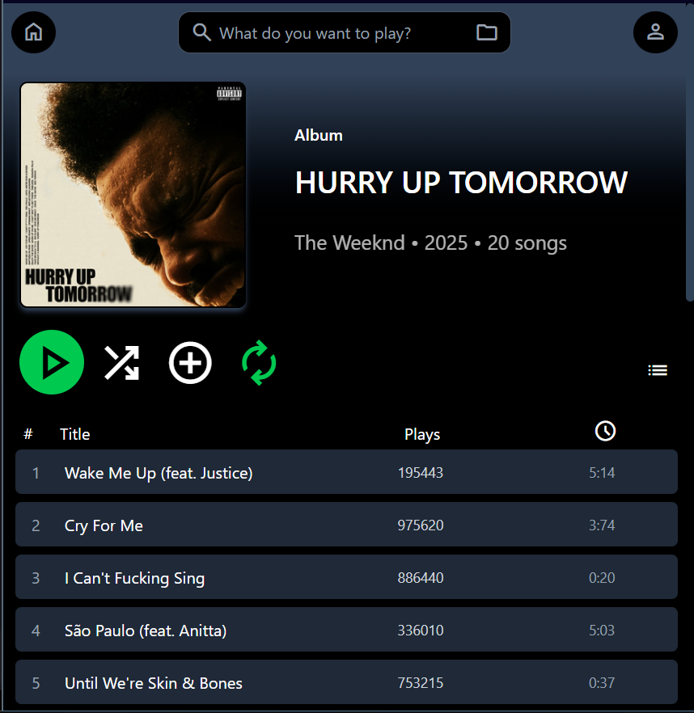
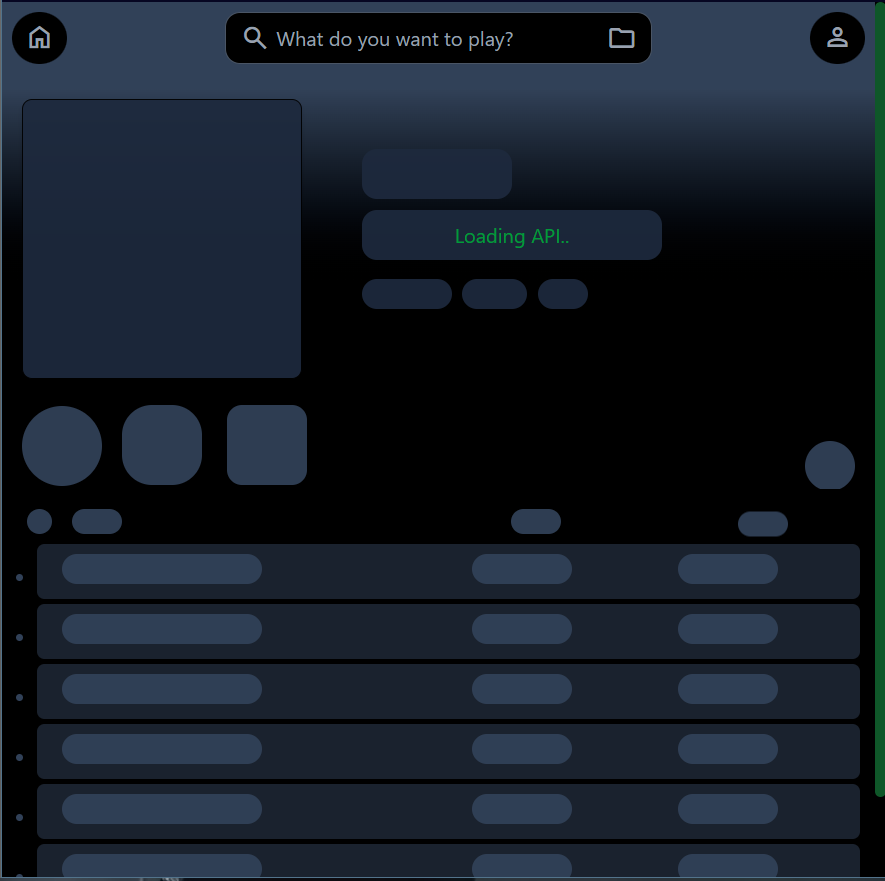

<h1 align="center">SpotifyApp-clone v1.5.2</h1>

  

 <strong>SpotifyApp</strong> — A clone of Spotify’s album tracklist page, built with React, Tailwind CSS, and TypeScript. It uses an API to fetch and display random albums, complete with tracklists and detailed album information.

<h2 align="center">Visit here</h2>

  <a href="https://spotifyapp-api.onrender.com">SpotifyApp.onrender.com</a>

<h2 align="center">🧐 Features</h2>

<h4>Here're some of the project's best features</h4>

**Dynamic Album Fetching:** Random albums with full details are fetched using a custom API.

**Detailed Album Pages:** Displays album covers, artist names, release dates, and complete tracklists.

**Track Playback UI:** An album track list layout mimicking Spotify’s theme.

**Fully Responsive Design:** Optimized with Tailwind CSS for smooth experience across all devices.

**TypeScript Integration:** Strong typing for safer, more maintainable code.

**Custom API Integration:** Backend built to serve random album data to the frontend.

  
<h2 align="center">Project Screenshots:</h2>

  

  

   
   <h4>~GIGI <code>Dore Robert</code></h4>
</footer>